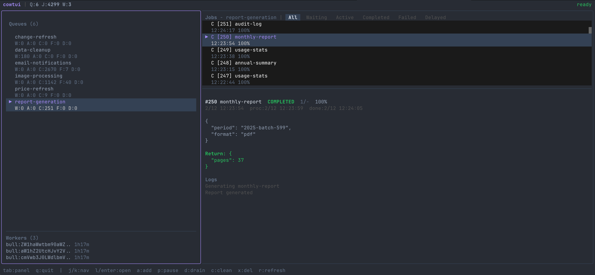

```
   .:*~*~*:.
 .* /     \ *.       ^__^       ^__^       ^__^
*  |       |  *     (oo)\______(oo)\______(oo)\______
*  |       |  *     (__)\      (__)\      (__)\      \
*  |       |  *          ||--w|     ||--w|     ||--w|
 '* \_____/ *'           ||   |     ||   |     ||   |
   '*~*~*~*'
```

# cowtui

TUI dashboard for [BullMQ](https://docs.bullmq.io). Monitor queues, browse jobs, inspect failures, manage workers. Vim-style keybindings.



## Quick Start

```bash
npx cowtui
# or
bunx cowtui

# Custom Redis
npx cowtui --host 192.168.1.10 --port 6380 --password secret --db 2

# Via env
REDIS_URL=redis://:password@host:port/db npx cowtui
```

Requires [Bun](https://bun.sh) and a running Redis instance.

## Development

```bash
bun install
bun run dev          # hot reload
bun run test-bullmq  # seed test queues + workers (separate terminal)
```

The test script spins up 4 queues with varying worker counts and failure rates, continuously adding jobs every few seconds.

## Layout

Two-panel split. Left: queue list + worker sidebar. Right: job list (filterable by state) + job detail pane. Detail updates live as you navigate.

## Keybindings

### Global

| Key | Action |
|-----|--------|
| `q` | Quit |
| `tab` | Switch panel |

### Queues (left)

| Key | Action |
|-----|--------|
| `j` / `k` | Navigate |
| `l` / `Enter` | Open in jobs panel |
| `a` | Add queue |
| `p` | Pause / resume |
| `d` | Drain (remove waiting jobs) |
| `c` | Clean completed |
| `x` | Delete queue |
| `r` | Refresh |

### Jobs (right)

| Key | Action |
|-----|--------|
| `j` / `k` | Navigate (detail updates live) |
| `h` / `l` | Cycle state filter |
| `Enter` | Inspect job |
| `r` | Retry job |
| `x` | Remove job |
| `a` | Add job |
| `Esc` | Back |

## Redis Connection

Priority (later overrides earlier):

1. Default: `localhost:6379`
2. `REDIS_URL` env var (Bun auto-loads `.env`)
3. CLI flags: `--host`, `--port`, `--password`, `--db`

## Stack

- [Bun](https://bun.sh) runtime
- [OpenTUI](https://github.com/anomalyco/opentui) React
- [BullMQ](https://docs.bullmq.io)
- [ioredis](https://github.com/redis/ioredis)

## License

GPL-3.0

---

Built with help from AI — used throughout development, particularly for code review.
